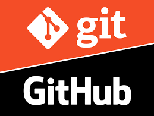

# Repositório de Estudos GIT

Este repositório foi criado para experimentar as funções, comandos e processos do GIT com proposta de estudo.

## Os códigos

Não foi utilizado nenhuma linguagem, só uma representação do que poderia ser uma aplicação para testar commits, pushs, pull e merges.

## Aprendizado

* **Commandos**
    * Parâmetros
    * Sintaxes
    * Configurações
* __Conceitos__
    * Fluxos de trabalhos
    * Boas práticas de documentações
    * Possibilidades de Gestão dos Projetos

## Markdown
**Negrito** ou __Negrito__

*Itálico* ou _Itálico_

# H1
## H2
### H3
#### H4
##### H5
###### H6

### Lista ordenada
1. Primeiro Item
    1. Subitem
    2. Subitem
        1. Subitem do Subitem
2. Segundo Item

### Lista não ordenada
* Item
    * Subitem
        * Sunitem do subitem

### Adicionando imagem

#### Imagem Local:


#### Imagem a partir de uma URL:


### Adicionando links

#### Link camuflado em um texto
[Google](https://www.google.com/)

#### Link puro:
[https://www.google.com/](https://www.google.com/)

#### Link Camuflado em uma imagem:
[](https://www.google.com/)

### Funções Markdown exclusivas do Github

#### Links
###### _*Para links do github não precisa de sitaxe é só colocá-lo direto._
https://github.com/thielis

#### Inserindo códigos:
```golang
//Exemplo de código em GO

package main

import "fmt"

func main() {
    fmt.Println("Olá mundo!")
}

```
#### Listas com Checkbox
- [X] Tarefa 1
- [ ] Tarefa 2
- [X] Tarefa 3
- [ ] Tarefa 4
